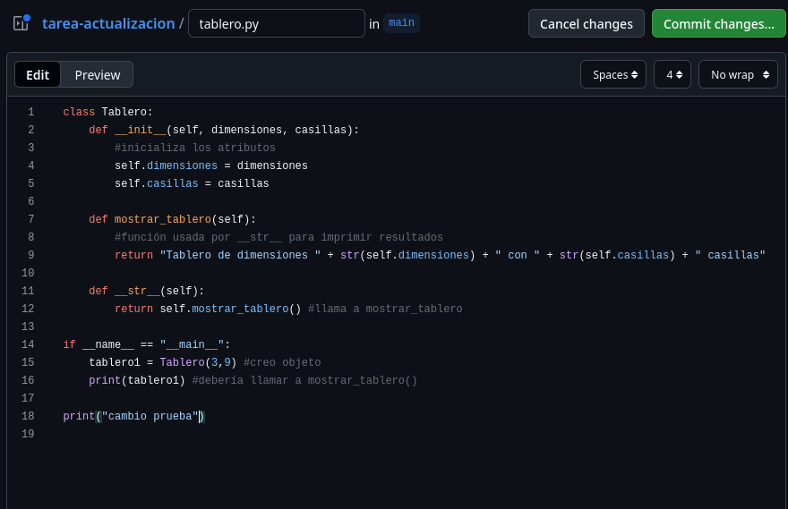
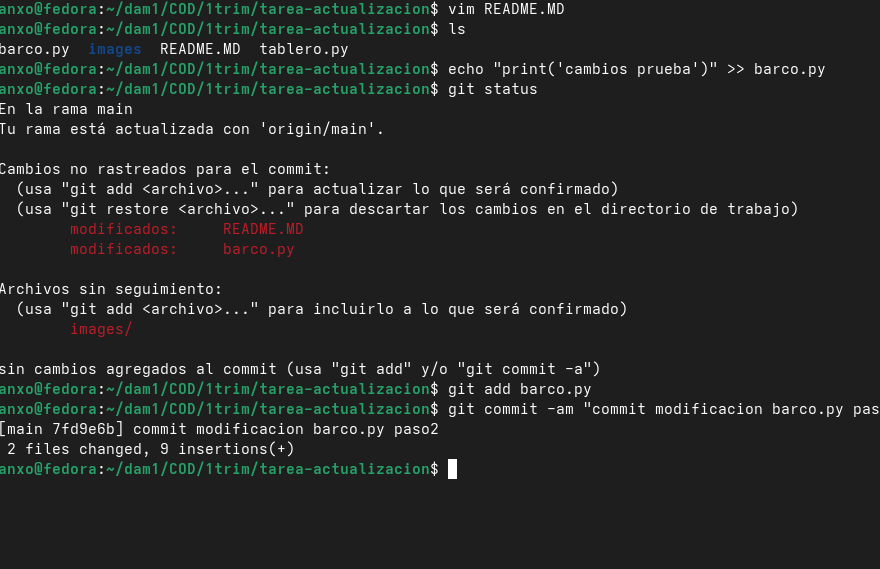
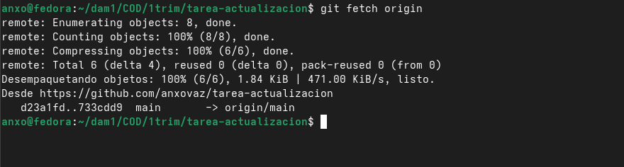
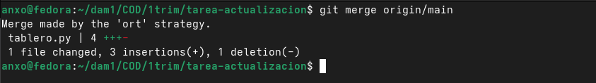
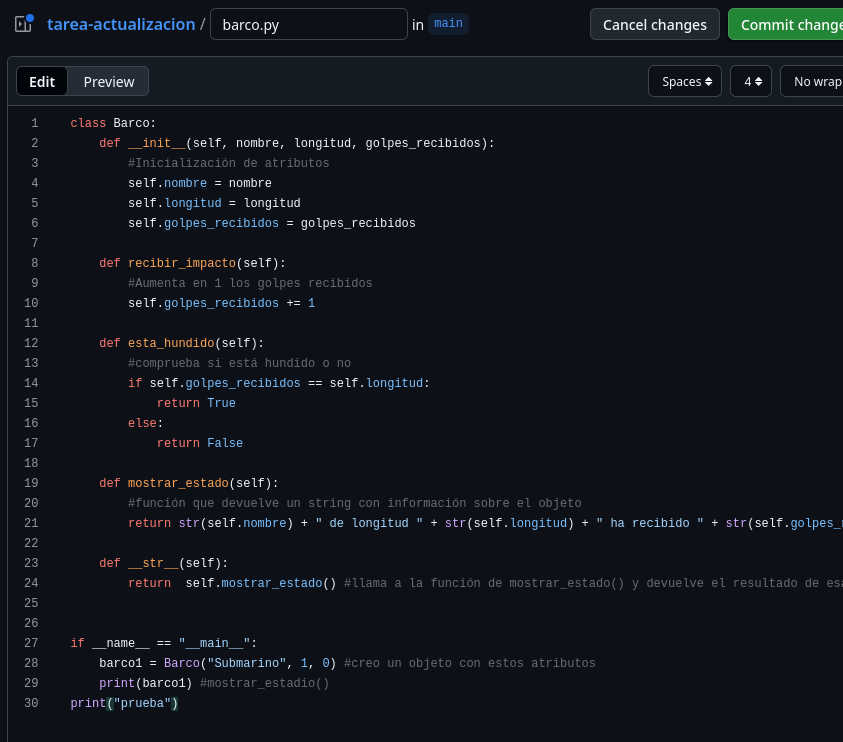
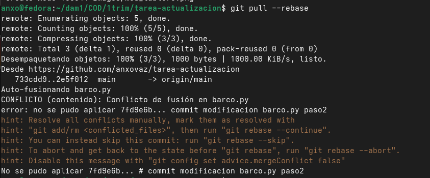
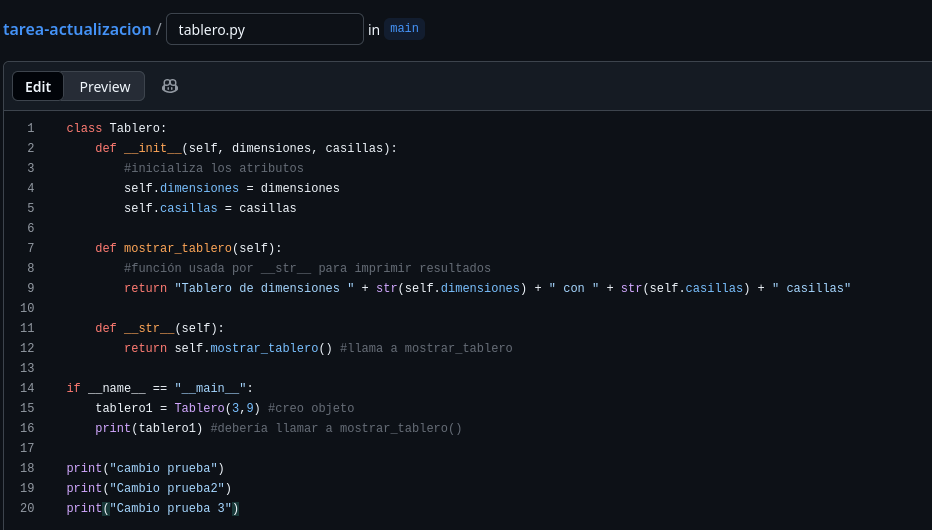
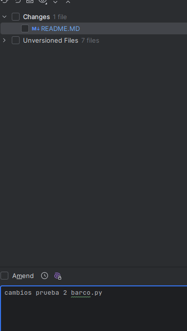
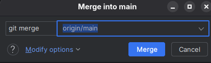

# Tarea: Sincronización con Repositorios Remotos

## git fetch, git pull y git rebase

### Anxo Vázquez Lorenzo (1DAM)

## Parte 1

### Paso 1

Una vez listo el repositorio en github con los archivos del ejercicio de `hundir la flota` y clonado localmente, accedo al repositorio de github y 
modifico el archivo `tablero.py`



### Paso 2

Modifico el archivo `barco.py` localmente y realizo un commit



### Paso 3

Me traigo los cambios para descargar el commit remoto sin fusionar.



### Paso 4

```
git log main..origin/main
commit 733cdd937880ac8fa73e419c0b5b687a00cd3471 (origin/main, origin/HEAD)
Author: anxovaz <avazquezlorenzo@danielcastelao.org>
Date:   Tue Dec 2 14:06:18 2025 +0100

    Arreglo tablero.py comillas

commit 9179bfd3e0f9059751da2b3bd5ae3d6900214f61
Author: anxovaz <avazquezlorenzo@danielcastelao.org>
Date:   Tue Dec 2 14:05:39 2025 +0100

    modificacion tablero.py
anxo@fedora:~/dam1/COD/1trim/tarea-actualizacion$ 
```

### Paso 5

Realizo un `git merge`




## Parte 2

### Paso 6

Accedo a github y modifico el archivo `barco.py`.



### Paso 7

Cambio localmente `tablero.py`:


Y realizo un `commit` local:

```
git commit -am "Segundo commit local"
```

### Paso 8

Sincronizo con `rebase`.

 

## Parte 3

Modifico `tablero.py` en remoto.



Hago cambios en `barco.py` y creo un `commit` local.



Utilizo `fetch` de `pycharm`.


Después uso `merge`



Para terminar hago un último pull con las actualizaciones del `Readme` y ejecuto `git log`.

```
anxo@fedora:~/dam1/COD/1trim/tarea-actualizacion$ git log
commit 21541658b188ac7f200d958a7e6464354b06eb4f (HEAD -> main, origin/main, origin/HEAD)
Author: anxovaz <avazquezlorenzo@danielcastelao.org>
Date:   Tue Dec 2 16:33:25 2025 +0100

    Actualización README.MD y añadiendo imagenes

commit 7665b87f9553a7bacb74d011ad75e5827a3386de
Merge: b3cea29 1e09e0c
Author: anxovaz <avazquezlorenzo@danielcastelao.org>
Date:   Tue Dec 2 16:31:51 2025 +0100

    Merge remote-tracking branch 'origin/main'

commit b3cea2971732b574e11ba1d4b36d9f9f7b475a87
Author: anxovaz <avazquezlorenzo@danielcastelao.org>
Date:   Tue Dec 2 16:28:42 2025 +0100

    cambios prueba 2 barco.py

commit 1e09e0cb838beb102e4bdb9d873df07fc3244256
Author: anxovaz <avazquezlorenzo@danielcastelao.org>
Date:   Tue Dec 2 16:26:06 2025 +0100
:...skipping...
commit 21541658b188ac7f200d958a7e6464354b06eb4f (HEAD -> main, origin/main, origin/HEAD)
Author: anxovaz <avazquezlorenzo@danielcastelao.org>
Date:   Tue Dec 2 16:33:25 2025 +0100

    Actualización README.MD y añadiendo imagenes

commit 7665b87f9553a7bacb74d011ad75e5827a3386de
Merge: b3cea29 1e09e0c
Author: anxovaz <avazquezlorenzo@danielcastelao.org>
Date:   Tue Dec 2 16:31:51 2025 +0100

    Merge remote-tracking branch 'origin/main'

commit b3cea2971732b574e11ba1d4b36d9f9f7b475a87
Author: anxovaz <avazquezlorenzo@danielcastelao.org>
Date:   Tue Dec 2 16:28:42 2025 +0100

    cambios prueba 2 barco.py

commit 1e09e0cb838beb102e4bdb9d873df07fc3244256
Author: anxovaz <avazquezlorenzo@danielcastelao.org>
Date:   Tue Dec 2 16:26:06 2025 +0100

:...skipping...
commit 21541658b188ac7f200d958a7e6464354b06eb4f (HEAD -> main, origin/main, origin/HEAD)
Author: anxovaz <avazquezlorenzo@danielcastelao.org>
Date:   Tue Dec 2 16:33:25 2025 +0100

    Actualización README.MD y añadiendo imagenes

commit 7665b87f9553a7bacb74d011ad75e5827a3386de
Merge: b3cea29 1e09e0c
Author: anxovaz <avazquezlorenzo@danielcastelao.org>
Date:   Tue Dec 2 16:31:51 2025 +0100

    Merge remote-tracking branch 'origin/main'

commit b3cea2971732b574e11ba1d4b36d9f9f7b475a87
Author: anxovaz <avazquezlorenzo@danielcastelao.org>
Date:   Tue Dec 2 16:28:42 2025 +0100

    cambios prueba 2 barco.py

commit 1e09e0cb838beb102e4bdb9d873df07fc3244256
Author: anxovaz <avazquezlorenzo@danielcastelao.org>
Date:   Tue Dec 2 16:26:06 2025 +0100

    cambio prueba 3 tablero.py

:...skipping...
commit 21541658b188ac7f200d958a7e6464354b06eb4f (HEAD -> main, origin/main, origin/HEAD)
Author: anxovaz <avazquezlorenzo@danielcastelao.org>
Date:   Tue Dec 2 16:33:25 2025 +0100

    Actualización README.MD y añadiendo imagenes

commit 7665b87f9553a7bacb74d011ad75e5827a3386de
Merge: b3cea29 1e09e0c
Author: anxovaz <avazquezlorenzo@danielcastelao.org>
Date:   Tue Dec 2 16:31:51 2025 +0100

    Merge remote-tracking branch 'origin/main'

commit b3cea2971732b574e11ba1d4b36d9f9f7b475a87
Author: anxovaz <avazquezlorenzo@danielcastelao.org>
Date:   Tue Dec 2 16:28:42 2025 +0100

    cambios prueba 2 barco.py

commit 1e09e0cb838beb102e4bdb9d873df07fc3244256
Author: anxovaz <avazquezlorenzo@danielcastelao.org>
Date:   Tue Dec 2 16:26:06 2025 +0100

    cambio prueba 3 tablero.py

commit 7151dba57eb79d3ecd12fca642391159aa467dde
:...skipping...
commit 21541658b188ac7f200d958a7e6464354b06eb4f (HEAD -> main, origin/main, origin/HEAD)
Author: anxovaz <avazquezlorenzo@danielcastelao.org>
Date:   Tue Dec 2 16:33:25 2025 +0100

    Actualización README.MD y añadiendo imagenes

commit 7665b87f9553a7bacb74d011ad75e5827a3386de
Merge: b3cea29 1e09e0c
Author: anxovaz <avazquezlorenzo@danielcastelao.org>
Date:   Tue Dec 2 16:31:51 2025 +0100

    Merge remote-tracking branch 'origin/main'

commit b3cea2971732b574e11ba1d4b36d9f9f7b475a87
Author: anxovaz <avazquezlorenzo@danielcastelao.org>
Date:   Tue Dec 2 16:28:42 2025 +0100

    cambios prueba 2 barco.py

commit 1e09e0cb838beb102e4bdb9d873df07fc3244256
Author: anxovaz <avazquezlorenzo@danielcastelao.org>
Date:   Tue Dec 2 16:26:06 2025 +0100

    cambio prueba 3 tablero.py

commit 7151dba57eb79d3ecd12fca642391159aa467dde
Author: anxovaz <avazquezlorenzo@danielcastelao.org>
:...skipping...
commit 21541658b188ac7f200d958a7e6464354b06eb4f (HEAD -> main, origin/main, origin/HEAD)
Author: anxovaz <avazquezlorenzo@danielcastelao.org>
Date:   Tue Dec 2 16:33:25 2025 +0100

    Actualización README.MD y añadiendo imagenes

commit 7665b87f9553a7bacb74d011ad75e5827a3386de
Merge: b3cea29 1e09e0c
Author: anxovaz <avazquezlorenzo@danielcastelao.org>
Date:   Tue Dec 2 16:31:51 2025 +0100

    Merge remote-tracking branch 'origin/main'

commit b3cea2971732b574e11ba1d4b36d9f9f7b475a87
Author: anxovaz <avazquezlorenzo@danielcastelao.org>
Date:   Tue Dec 2 16:28:42 2025 +0100

    cambios prueba 2 barco.py

commit 1e09e0cb838beb102e4bdb9d873df07fc3244256
Author: anxovaz <avazquezlorenzo@danielcastelao.org>
Date:   Tue Dec 2 16:26:06 2025 +0100

    cambio prueba 3 tablero.py

commit 7151dba57eb79d3ecd12fca642391159aa467dde
Author: anxovaz <avazquezlorenzo@danielcastelao.org>
Date:   Tue Dec 2 16:20:12 2025 +0100
:...skipping...
commit 21541658b188ac7f200d958a7e6464354b06eb4f (HEAD -> main, origin/main, origin/HEAD)
Author: anxovaz <avazquezlorenzo@danielcastelao.org>
Date:   Tue Dec 2 16:33:25 2025 +0100

    Actualización README.MD y añadiendo imagenes

commit 7665b87f9553a7bacb74d011ad75e5827a3386de
Merge: b3cea29 1e09e0c
Author: anxovaz <avazquezlorenzo@danielcastelao.org>
Date:   Tue Dec 2 16:31:51 2025 +0100

    Merge remote-tracking branch 'origin/main'

commit b3cea2971732b574e11ba1d4b36d9f9f7b475a87
Author: anxovaz <avazquezlorenzo@danielcastelao.org>
Date:   Tue Dec 2 16:28:42 2025 +0100

    cambios prueba 2 barco.py

commit 1e09e0cb838beb102e4bdb9d873df07fc3244256
Author: anxovaz <avazquezlorenzo@danielcastelao.org>
Date:   Tue Dec 2 16:26:06 2025 +0100

    cambio prueba 3 tablero.py

commit 7151dba57eb79d3ecd12fca642391159aa467dde
Author: anxovaz <avazquezlorenzo@danielcastelao.org>
Date:   Tue Dec 2 16:20:12 2025 +0100

:...skipping...
commit 21541658b188ac7f200d958a7e6464354b06eb4f (HEAD -> main, origin/main, origin/HEAD)
Author: anxovaz <avazquezlorenzo@danielcastelao.org>
Date:   Tue Dec 2 16:33:25 2025 +0100

    Actualización README.MD y añadiendo imagenes

commit 7665b87f9553a7bacb74d011ad75e5827a3386de
Merge: b3cea29 1e09e0c
Author: anxovaz <avazquezlorenzo@danielcastelao.org>
Date:   Tue Dec 2 16:31:51 2025 +0100

    Merge remote-tracking branch 'origin/main'

commit b3cea2971732b574e11ba1d4b36d9f9f7b475a87
Author: anxovaz <avazquezlorenzo@danielcastelao.org>
Date:   Tue Dec 2 16:28:42 2025 +0100

    cambios prueba 2 barco.py

commit 1e09e0cb838beb102e4bdb9d873df07fc3244256
Author: anxovaz <avazquezlorenzo@danielcastelao.org>
Date:   Tue Dec 2 16:26:06 2025 +0100

    cambio prueba 3 tablero.py

commit 7151dba57eb79d3ecd12fca642391159aa467dde
Author: anxovaz <avazquezlorenzo@danielcastelao.org>
Date:   Tue Dec 2 16:20:12 2025 +0100

    Cambios en README.MD y agregar images/

commit 2e5f012f77b872faa8fc3bc6d7b1e7604934f329
Author: anxovaz <avazquezlorenzo@danielcastelao.org>
Date:   Tue Dec 2 14:20:18 2025 +0100

    cambios barco.py

commit 733cdd937880ac8fa73e419c0b5b687a00cd3471
Author: anxovaz <avazquezlorenzo@danielcastelao.org>
Date:   Tue Dec 2 14:06:18 2025 +0100

    Arreglo tablero.py comillas

commit 9179bfd3e0f9059751da2b3bd5ae3d6900214f61
Author: anxovaz <avazquezlorenzo@danielcastelao.org>
Date:   Tue Dec 2 14:05:39 2025 +0100

    modificacion tablero.py

commit d23a1fd5185db9305dec4e89095c8ec17d317670
Author: anxovaz <avazquezlorenzo@danielcastelao.org>
Date:   Tue Dec 2 13:59:13 2025 +0100

    Agregar README.MD

commit 1c63ef50497df116ef80491a3593cb10cb58d421
Author: anxovaz <avazquezlorenzo@danielcastelao.org>
Date:   Tue Dec 2 13:53:45 2025 +0100

    Añadiendo barco.py y tablero.py
```
